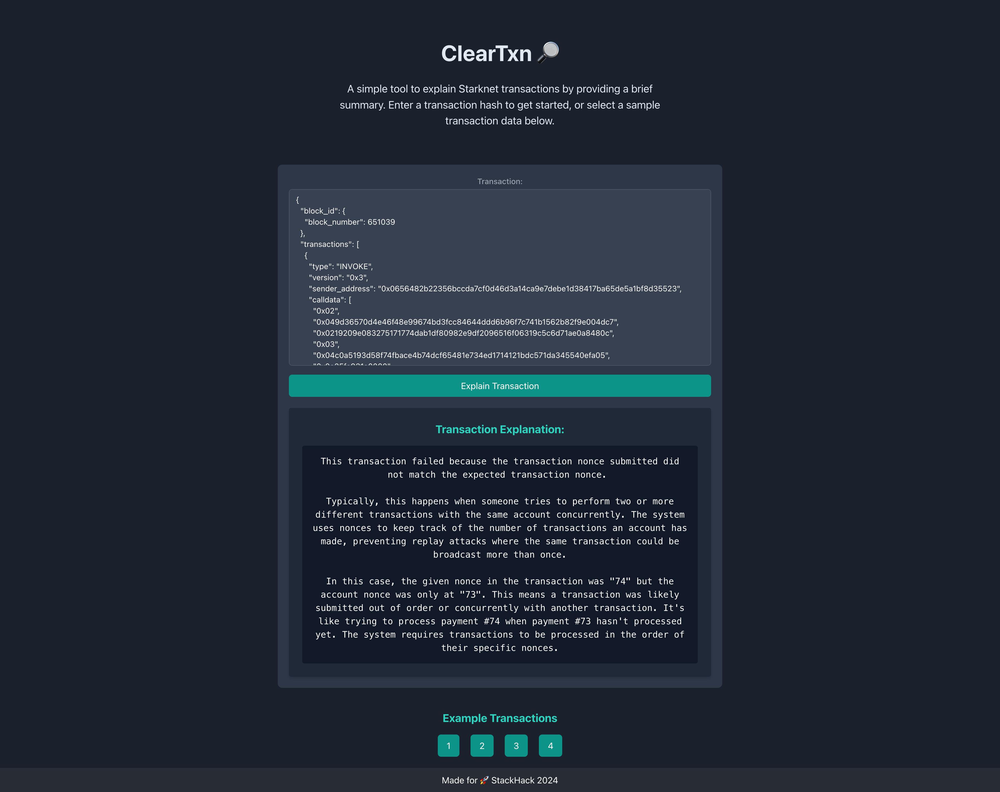

  <h1>ClearTxn 🔎</h1>

Transforms complex transaction data into clear, concise, and user-friendly information

[Try it out](https://cleartxn.xyz/)

## Description

This project has a user-friendly interface that anyone can visit to input any transaction. After the user submits a transaction, the system processes it and provides a straightforward explanation of what the transaction did. This way, users can easily understand the details and effects of their transactions without needing any technical knowledge.

## Technical

When a user inputs a transaction on the frontend, it is sent to the backend for processing. 
The backend uses the starknet_simulateTransactions method to simulate the transaction. This simulation provides various useful data points, including the different function calls and any emitted events.

The backend extracts these function calls and events, then uses the Voyager API to fetch the ABIs (Application Binary Interfaces) for the class hashes. From these ABIs, it retrieves the function and event names. For certain events, additional information is extracted as well.

All the gathered information is then formatted into a prompt for a Language Learning Model (LLM). The LLM is tasked with translating this technical transaction data into a human-readable explanation for the user.

Finally, the backend sends this explanation back to the frontend, where it is displayed to the user.

## getting started

### backend

- install requirements.txt `pip3 install -r requirements.txt`
- create .env from .env_template
- `python3 backend.py`

### backend

- change config.ts to point to the backend
- `npm i`
- `npm start`

### Preview

